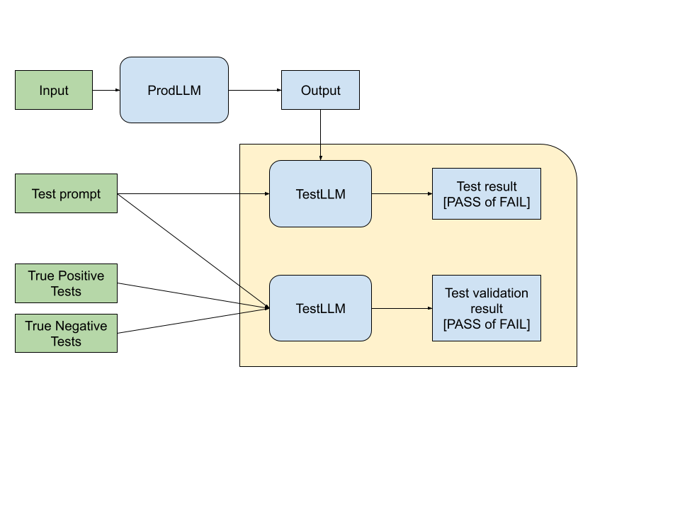

# Validated-AI-Tests
Automated way to test complex LLM outputs.

Entities:
1. ProdLLM that we want to test
    + Input
    + Produced Output
2. For each Input we have a Test Prompt, which contains description of Acceptable Output
3. TestLLM that we use for testing

## Run Example

Run example with python3 -m examples.example